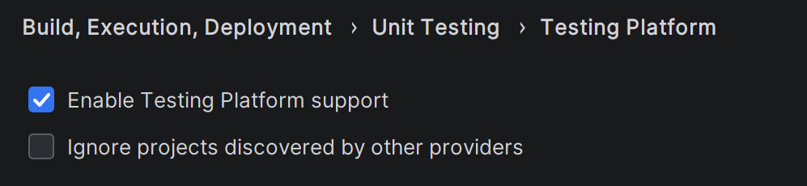

# Rider Settings

## Enable TUnit Test Discovery

By default, Rider may not discover TUnit tests. To enable this, go to
**Settings → Build, Execution, Deployment → Unit Testing → Test Runner** and enable
**"Use test runner from project"** (or the equivalent option as shown below).

