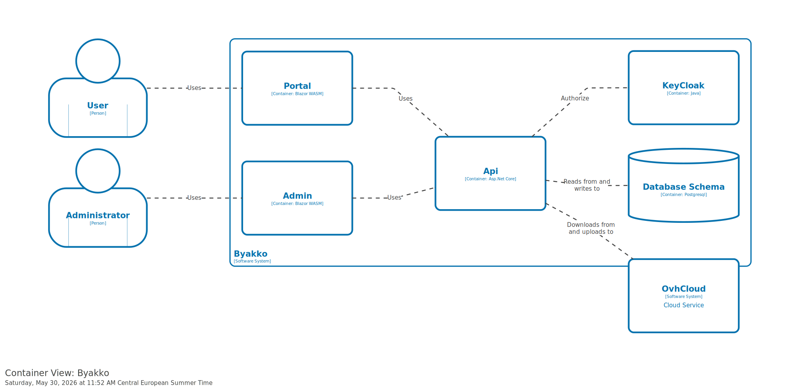

# Containers

The container diagram shows the internal structure of the Byakko platform.

- **Portal** — Blazor WebAssembly frontend for end users. Communicates with the Api.
- **Admin** — Blazor WebAssembly frontend for administrators. Communicates with the Api.
- **Api** — ASP.NET Core backend. Handles all business logic, encrypts content with AES-256 before upload and decrypts it on download, and delegates persistence to the Database Schema and OVHCloud.
- **Keycloak** — Identity and access management server. Provides JWT-based authentication for the Api, Portal, and Admin.
- **Database Schema** — PostgreSQL database. Stores asset metadata and application state.
- **OVHCloud** — S3-compatible object storage. Stores the AES-256 encrypted binary content of uploaded assets. In local development this is replaced by a Localstack instance via LocalStack.

