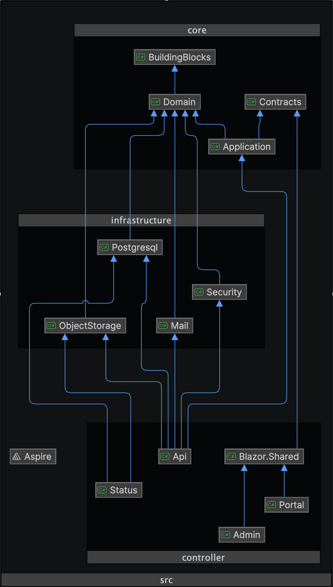

# Project Dependencies

The project dependency diagram shows how the layers of the Byakko solution relate to each other, following Clean Architecture principles. Dependencies flow inward — outer layers depend on inner layers, never the reverse.

- **BuildingBlocks** — DDD base types (`AggregateRoot`, `Entity`, `ValueObject`, `Result`). Has no dependencies on any other layer.
- **Domain** — Domain models, aggregates, and domain events. Depends only on BuildingBlocks.
- **Contracts** — Shared request/response DTOs. Depends only on BuildingBlocks.
- **Application** — Business logic and use cases. Depends on Domain and Contracts; must not depend on any Infrastructure layer or Controllers.
- **Infrastructure** (`Postgresql`, `ObjectStorage`, `Security`, `Mail`) — Concrete implementations of application interfaces. Depends on Application and Domain; must not depend on Controllers.
- **Controller.Api** — ASP.NET Core Minimal API host. Depends on Application, Contracts, and all Infrastructure layers.
- **Controller.Blazor.Shared** — Razor Class Library shared by Admin and Portal. Depends only on Contracts.
- **Controller.Admin / Controller.Portal** — Blazor WebAssembly frontends. Depend on Blazor.Shared and Contracts; must not depend on Domain, Application, or Infrastructure.
- **Controller.Status** — Blazor Server status dashboard. Depends on Application, Domain, and Infrastructure (Postgresql, ObjectStorage) for health checks.

