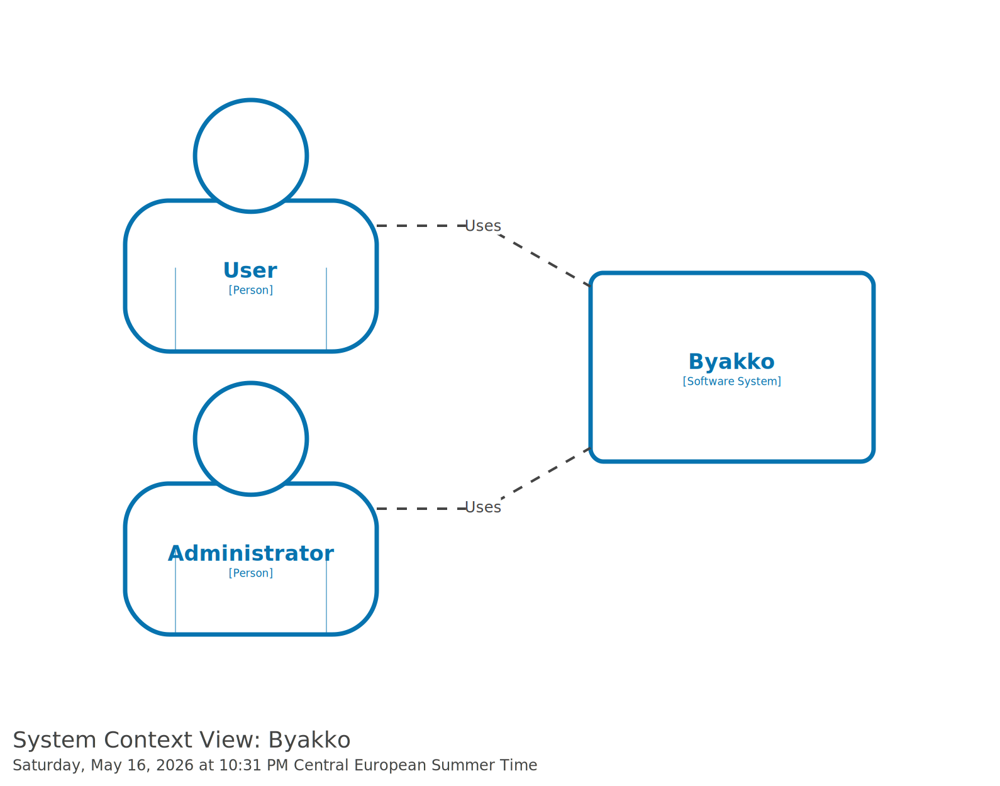

# System Context

The system context diagram shows the Byakko platform and the two types of people who interact with it.

- **User** — accesses the platform via the Portal to upload, manage, and retrieve files.
- **Administrator** — manages the platform via the Admin interface.

